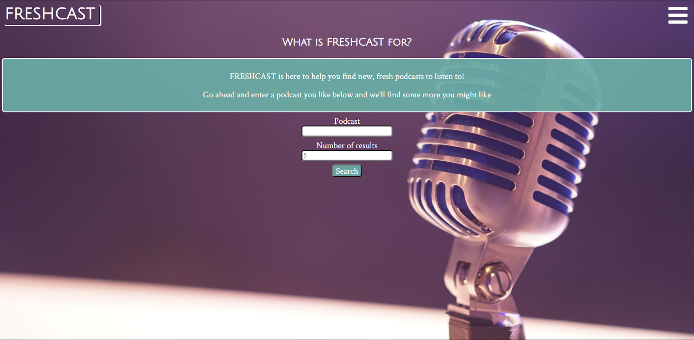
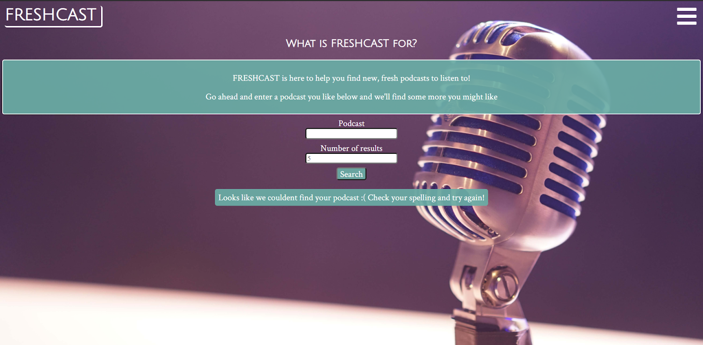
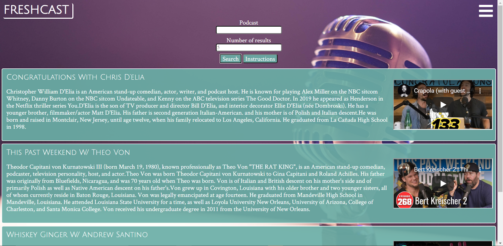
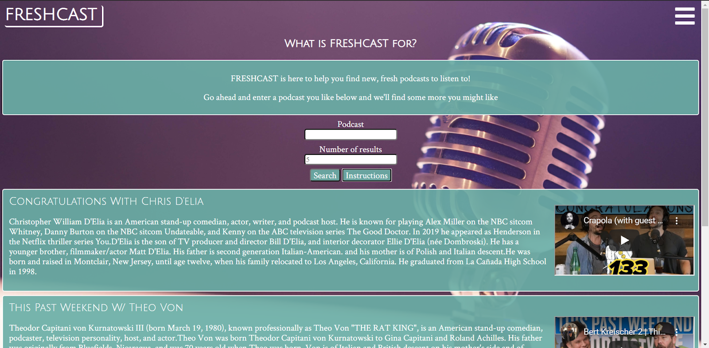
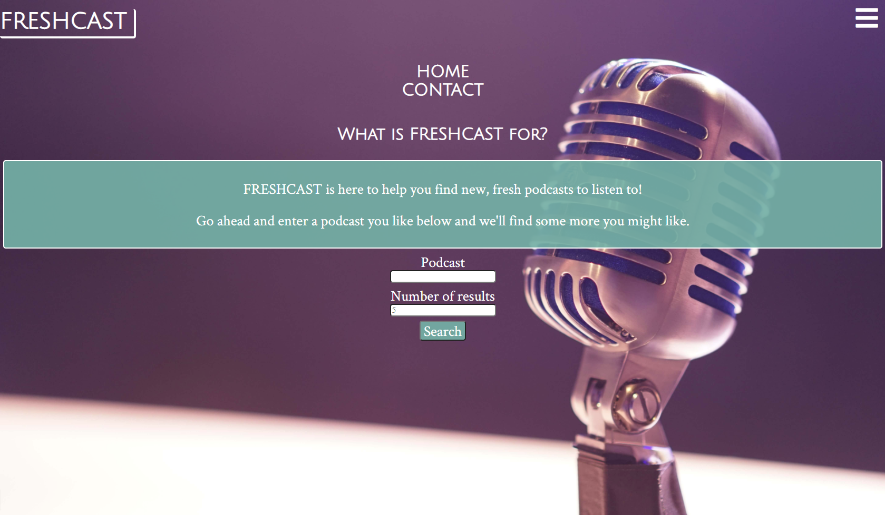
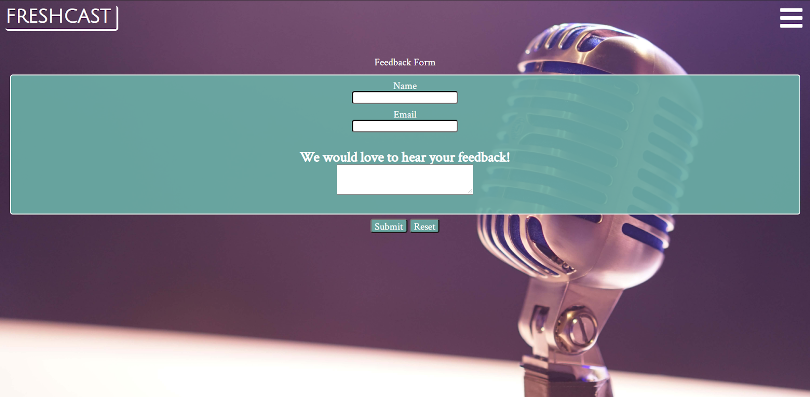

FRESHCAST
=========

> What does FRESHCAST do? FRESHCAST is an app to help you find new podcasts to listen to.
> Simply put in a podcast you listen to already, and we'll find new ones you might like!

## Screenshots

> When a user first loads the page, they will see the landing page

> If the user doesent enter a podcast or the podcast cant be found, they will get an error

> Once a valid podcast is entered, a list of suggestions will be rendered to the DOM

> If the user needs the instructions again at any time, they can hit the instructions button

> If you hit the nav icon in the top right, you will see the nav menu that can take you home or to the feedback form

> If "Contact" is selected, you will be brought to the feedback form page

> ## What technologies were used?
> * HTML/CSS
> * JavaScript
> * Jquery

## Link to live demo
![live demo](
